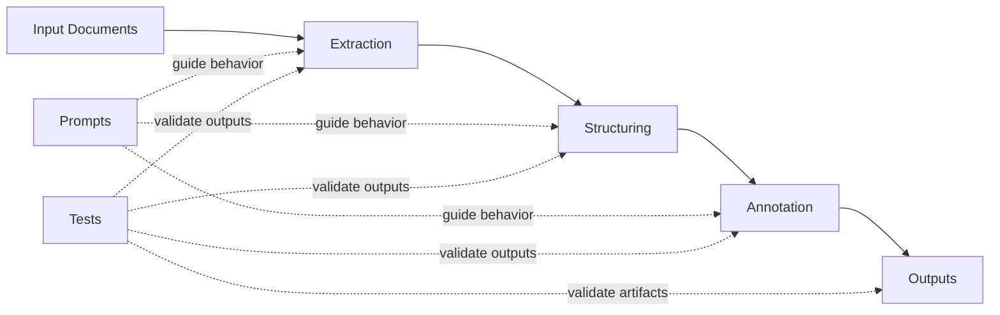

# Architecture Overview

This document provides a high-level map of the Lexperto processing flow and how prompts and tests relate to pipeline stages.

## Stage Notes

- **Input Documents**: Source legal artifacts that enter the pipeline.
- **Extraction**: Captures relevant fields and entities from raw documents.
- **Structuring**: Normalizes extracted information into expected schemas.
- **Annotation**: Enriches structured content with labels and contextual metadata.
- **Outputs**: Persisted artifacts used for downstream review and integration.

## Prompts and Tests Relationship

- Prompts define stage behavior and quality expectations for extraction, structuring, and annotation.
- Tests provide regression coverage and confidence that each stage and output contract remains stable.
