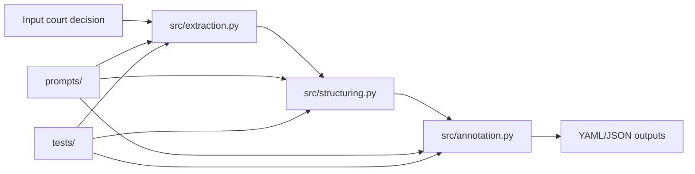

# Lexperto Presentation Cleanup Implementation Plan

> **For agentic workers:** REQUIRED SUB-SKILL: Use superpowers:subagent-driven-development (recommended) or superpowers:executing-plans to implement this plan task-by-task. Steps use checkbox (`- [ ]`) syntax for tracking.

**Goal:** Improve repository presentation for hiring reviewers and technical collaborators through low-risk documentation and structure cleanup.

**Architecture:** The plan is documentation-first and keeps runtime behavior unchanged. Work starts with an explicit repository inventory, then updates top-level navigation and README audience pathways, and finally applies controlled hygiene moves with verification.

**Tech Stack:** Markdown docs, Git, Pixi tasks (`smoke`, `test-quick`), Python project layout

---

### Task 1: Baseline Inventory and Cleanup Decision Log

**Files:**
- Create: `docs/repo-inventory.md`
- Modify: none
- Test: n/a (command validation)

- [ ] **Step 1: Create an inventory file with current root state and keep/remove/archive decisions**

```markdown
# Repository Inventory

Date: 2026-05-28

## Root Items

- `README.md` -> keep (project entrypoint)
- `docs/` -> keep (documentation)
- `src/` -> keep (core pipeline)
- `tests/` -> keep (verification)
- `prompts/` -> keep (active prompt assets)
- `prompts-test/` -> archive candidate (legacy/duplicate prompt assets)
- `alex.txt` -> remove candidate (noise file)
- `amtshilfe-urteil.plugin` -> archive candidate (non-core artifact)
- `test_temp/` -> evaluate/remove if generated artifact
- `run_logs/` -> evaluate/remove if generated artifact
```

- [ ] **Step 2: Run root inventory command and compare to the inventory file**

Run: `ls`  
Expected: root listing matches `docs/repo-inventory.md` entries and each candidate has a disposition note.

- [ ] **Step 3: Commit inventory baseline**

```bash
git add docs/repo-inventory.md
git commit -m "docs: add repository inventory and cleanup decisions"
```

Expected: commit created with one new docs file.

### Task 2: Add Documentation Navigation Entrypoint

**Files:**
- Create: `docs/README.md`
- Modify: none
- Test: n/a (link and render checks)

- [ ] **Step 1: Create docs index with audience-oriented navigation**

```markdown
# Documentation Index

This directory contains project-facing documentation and internal planning artifacts.

## Start Here

- Hiring reviewer quick path: `../README.md#for-hiring-reviewers-2-minute-scan`
- Technical collaborator path: `../README.md#for-technical-collaborators`

## Repository Cleanup Context

- Cleanup handoff: `../lexperto-repo-cleanup-handoff.md`
- Approved cleanup design: `superpowers/specs/2026-05-28-lexperto-presentation-cleanup-design.md`

## Architecture

- Overview diagram: `architecture-overview.md`

## Superpowers Artifacts

- Specs: `superpowers/specs/`
- Plans: `superpowers/plans/`
```

- [ ] **Step 2: Create architecture overview document with Mermaid diagram**

Run:
`cat > docs/architecture-overview.md <<'EOF'
# Architecture Overview



Notes:
- `src/` is the stable core pipeline area.
- `experiments/` is exploratory and not part of the stable contract.
EOF`

Expected: `docs/architecture-overview.md` exists with one Mermaid block.

- [ ] **Step 3: Commit docs navigation artifacts**

```bash
git add docs/README.md docs/architecture-overview.md
git commit -m "docs: add documentation index and architecture overview"
```

Expected: commit created with two new docs files.

### Task 3: README Dual-Audience Restructure

**Files:**
- Modify: `README.md`
- Test: n/a (command and link verification)

- [ ] **Step 1: Insert audience-specific entry sections near the top of README**

```markdown
## For Hiring Reviewers (2-minute scan)

- Prototype for AI-assisted legal drafting support on Swiss tax-information-exchange rulings.
- Core value: extracts sections and paragraph hierarchy, then annotates legal reasoning units.
- Technical depth: LangChain/LangGraph pipeline in `src/`, tested with `pytest`, reproducible via Pixi.
- Safety framing: research prototype, no institutional deployment, not production legal software.
- Quick credibility check: run `pixi run smoke`.

## For Technical Collaborators

- Setup: `pixi install` then `cp .env.example .env`
- Fast check: `pixi run smoke`
- Targeted tests: `pixi run test-quick`
- Full test run: `pixi run test`
- Stable core: `src/`, `tests/`, `prompts/`
- Exploratory area: `experiments/` (non-contractual)
```

- [ ] **Step 2: Add a compact repository map section**

```markdown
## Repository Map

- `src/` - core extraction, structuring, and annotation pipeline
- `tests/` - unit/integration-style validation
- `prompts/` - active prompt assets used by the core pipeline
- `experiments/` - exploratory scripts and prototypes
- `docs/` - project documentation and planning artifacts
```

- [ ] **Step 3: Verify README command coherence**

Run: `rg "pixi run smoke|pixi run test-quick|pixi run test" README.md`  
Expected: all three commands appear exactly once or in clearly separated sections with no contradictions.

- [ ] **Step 4: Commit README presentation restructure**

```bash
git add README.md
git commit -m "docs: restructure README for hiring and collaborator audiences"
```

Expected: commit created with README-only changes.

### Task 4: Controlled Hygiene Cleanup

**Files:**
- Modify: `docs/repo-inventory.md`
- Delete/Move: `alex.txt`, `prompts-test/`, `amtshilfe-urteil.plugin` (according to decisions)
- Create: `archive/README.md` (if archiving is used)
- Test: n/a (git status verification)

- [ ] **Step 1: Create archive folder documentation (if any item is archived)**

```markdown
# Archive

This directory stores non-core repository artifacts retained for traceability.

- Content here is not part of the active pipeline contract.
- Archived files may be outdated, experimental, or presentation-noise for public repo views.
```

- [ ] **Step 2: Apply hygiene actions exactly as documented in `docs/repo-inventory.md`**

Run (example):
`rm alex.txt && mkdir -p archive && mv amtshilfe-urteil.plugin archive/ && mv prompts-test archive/`

Expected: removed/archived artifacts match inventory decisions; no accidental movement of core directories.

- [ ] **Step 3: Update inventory with executed actions and rationale**

```markdown
## Executed Actions

- `alex.txt` removed (noise file, no project value)
- `amtshilfe-urteil.plugin` archived under `archive/` (non-core artifact)
- `prompts-test/` archived under `archive/` (legacy duplicate prompt assets)

## Verification

- Root now contains only project-facing artifacts and intentional directories.
```

- [ ] **Step 4: Validate clean top-level presentation**

Run: `ls`  
Expected: root listing has intentional top-level structure without stray noise files.

- [ ] **Step 5: Commit hygiene cleanup**

```bash
git add -A
git commit -m "chore: clean repository surface and archive non-core artifacts"
```

Expected: commit created with documented remove/archive operations.

### Task 5: Final Presentation Verification

**Files:**
- Modify: none (unless fixes are required)
- Test: `README.md`, `docs/README.md`, `docs/architecture-overview.md`

- [ ] **Step 1: Run documented reviewer and collaborator quick commands**

Run: `pixi run smoke && pixi run test-quick`  
Expected: both commands complete successfully.

- [ ] **Step 2: Validate docs navigation links**

Run: `rg "architecture-overview|For Hiring Reviewers|For Technical Collaborators" README.md docs/README.md`  
Expected: all anchors and references exist in the targeted files.

- [ ] **Step 3: Check final repository status**

Run: `git status --short`  
Expected: clean working tree.

- [ ] **Step 4: Create final wrap-up commit if verification required doc touch-ups**

```bash
git add README.md docs/README.md docs/architecture-overview.md docs/repo-inventory.md
git commit -m "docs: finalize presentation cleanup verification"
```

Expected: only needed if verification discovered issues; otherwise skip this commit.
